Trading 1-candle.

Candle Variations 

1. Disrespect candle 
2. Respect Candle 

Disrespect candle 
- can be bulish or Bearish. 
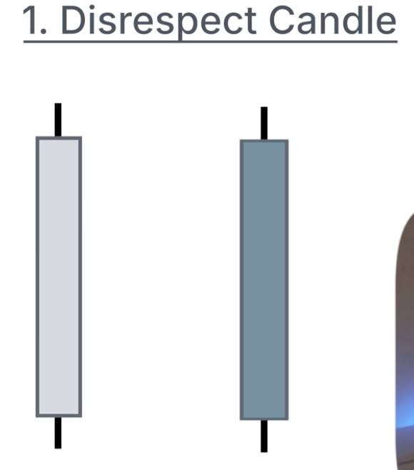
Characteristics 
- big body relative to the wicks, wicks are significantlly smaller on both sides
i.e the height of the 2 wicks combined should be smaller that the body height. 

Respect Candle 
- can be bulish or Bearish. 
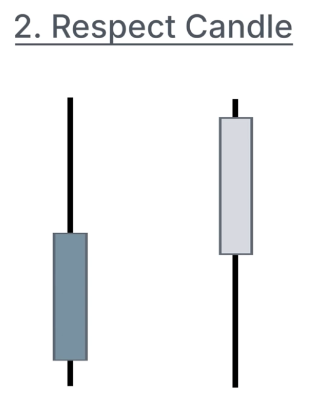
Characteristics 
- long wick at the bottom or top of the candle 
NB. at times the color of the body might not matter alot, what matters is where is the wick, at the bottom or top?

HTF to LTF mapping.
Disrespect Candle
How the Disrespect candle is represented on the LTF. 
A weekly Bulish disrespect candle on the lower timeframe it has a no. of Bulish Fair value gaps. 
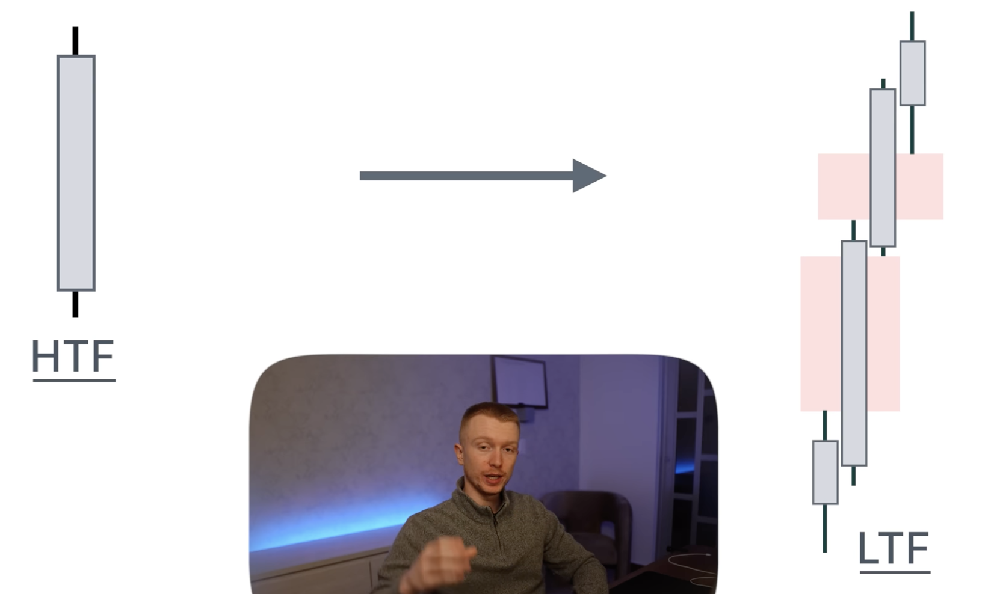

Similar but opposite to a Bearish one it also a no of Bearish Fair value gaps. 

Respect candle
- they symbolise a reversal on the lower timeframe

Bulish respect candle. 
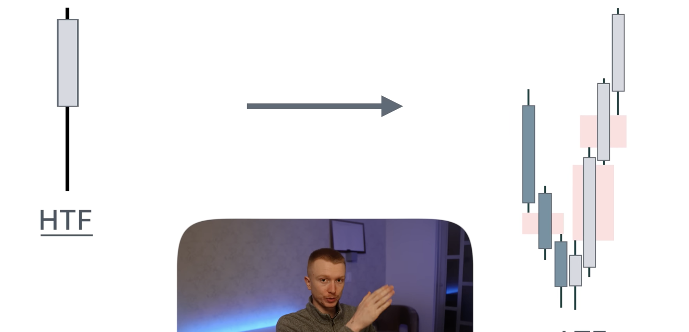
- long wick at the bottom creates a sharp turn. 
i.e Bearish FVG going down and imediately over turned by bullish FVG going higher (Forming an iFVG). 

Bearish FVGs are now used as manipulation gaps. 

Bearish respect candle. 
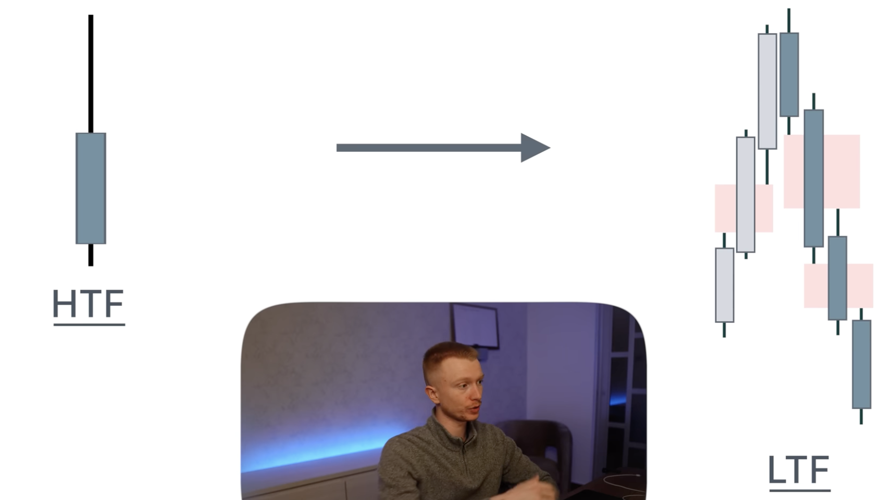

3. Target. 
Where does the next candle want to trade towards. 

Easiest Target. 
PXH & PXL
X - respective timeframe Candle
PXH - previous Candle High
PXL - Previous Candle Low

Directional Bias
So on a weekly candle our goal is to predict where are we going to first trade towards. The Candle Low? or the Candle High?

The Type of candle Tells us which side are we Targeting First. 

Respect Bearish Candle (AKA Rejection Candle) - 1st Target is its Low. 

Limitations to Following just one Candle Shape. 
- at times a weekly Bearish Candle could close Taping into a Bulish POI (i.e) for a bulish market structure, in that case price will not aim for low prices because the underlying Structure target has been full filled. 
example. 
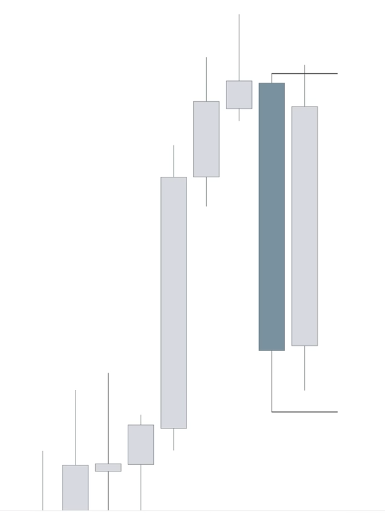
This Disrespect Bearish Candles' next candle broke the pattern because of the above reason.

Meaning that Once Price has closed near Weekly Strong POIS. then following the candles' target might be errorneous. but instead switch to the Structure positioning to know the next target

Disrespect candle is a continuation candle where as the respect candle a reversal candle

Situations where the Target can be adjusted. 

Note. 
In bulish conditions the target is always a bearish premium PD array. 
In bearish conditions the target is always a Bullish Discount PD array. 

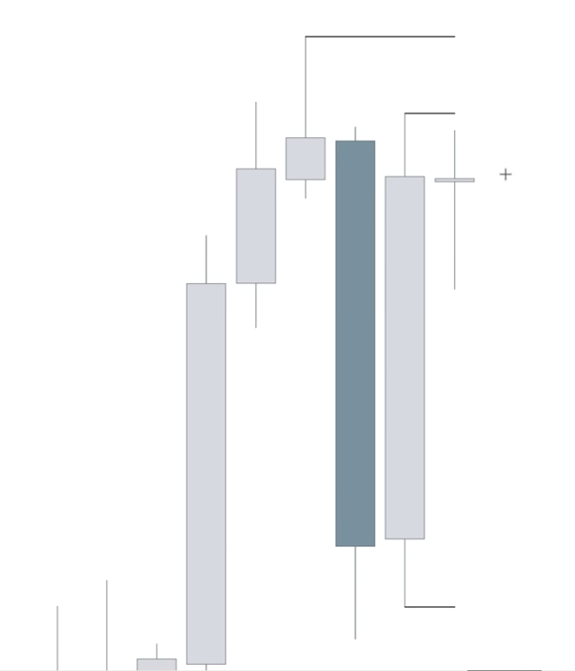
in this Scenario the next target after the Prevous candle high was the swing high. 

Once the weekly high is also violated/Disrespected, we can zoom out and start tartgeting monthly PD-arrays. 

in this case after violating the weekly high the monthly high was the next target. 
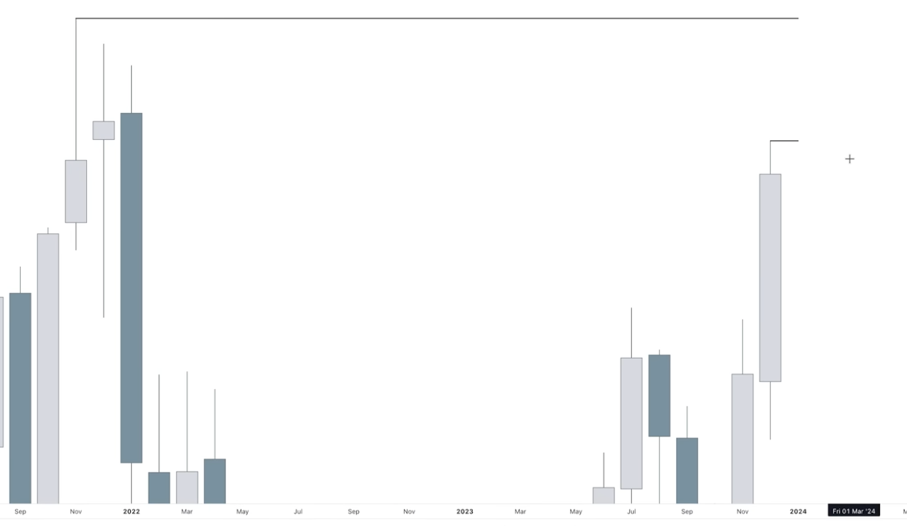

So far using these concepts we have determined the Bias and the Draw on Liquidity. 

Next Task is to find the PD-Array where we want to continue higher/lower from 

How do we do this, We drop down to lower timeframes.
Ideally we are not supposed to go lower than 3 times from from the current timeframe. 

For a Bullish scenario, we need a discount PD array/ support that we can continue from. 

4. PD arrays
- Fair Value gaps. 
- Mitigation Blocks 
- Breaker blocks 
- Orderblocks
- Swing high/ Swing low. 
- PCH, PCL

Deciding where to enter from. 
1. Month timeframe, Bullish disrespect candle Candle. 

2. on weekly TF. 

- What pd arrays do we see on the weekly. 
1. FVG at top 
2. second FVG below 
3. Mitigation Block marked with a BOS line (overlaping with the second FVG)
Second FVG is then refined with the mitigation line. 
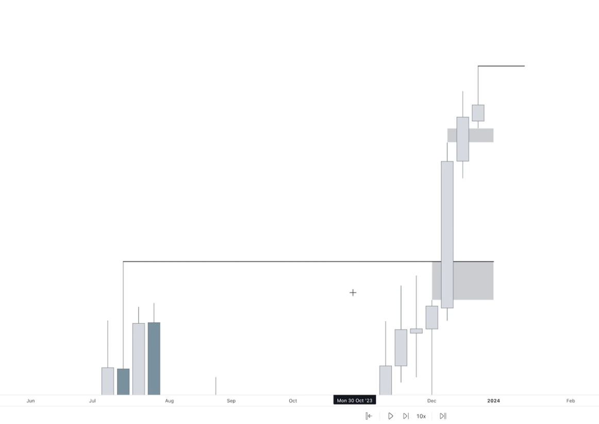

Comment- if price is not going to continue higher from the first FVG then the second is also not likely to hold. 

NB. once a good area to continue from is established on 1TF lower it means we dont need to continue going to other lower TF. 

After establishing The POIs, then we repeat the same concepts on the LTF. 

For instance the Weekly outlook ended with a candle that respected the upside meaning price was likely going to target that candles low before it continues higher. 

Result. 
Price sold Back to the refined FVG inside the mitigation block. And closed with a reasonable week on the downside. Not so big but reasonable to notice that the downside is being respected. 
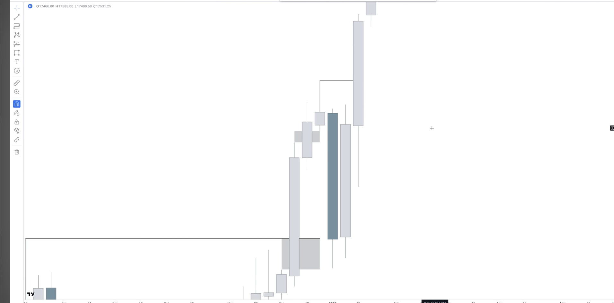
And from there it started buying again. upto the Monthly High First then, Swing High next

Note. That once Price Reaches the POI we can still use the same concepts for entry. I.e if you are intending to buy wait untill We start having Bullish Disrespect candles or candles that are respecting the downside. then inside those candles find FVGs we can trade off of. for instance this could be done on the 15M timeframe. 

Handling Exemption Scenarios. 
On the Weekly Time Frame we also need to Findout POIs close by i.e FVGS, OB, Swing high, swing lows, Breaker blocks. 

if any of these W - POIS are in contact with our weekly candle and the Week Closed to a candle that not respect that POI,

Then we dont need to rush to trade the Prev week candle, rather we need to wait for the new week to play out and see what is the resultant candle, is the candle respecting the weekly POI, is it an indision candle? 

For a respecting candle or indicision candle it means we can target the oppsing liquidity. (3 candle pattern). 

Example 
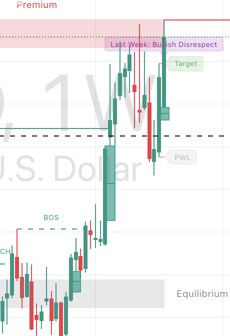

- Weekly disrespect Bearish Candle interfering with a Weekly FVG, The next candle after that was an indicision candle. => the third candle will target candle1's High. 

The same should be true for a bearish scenario

