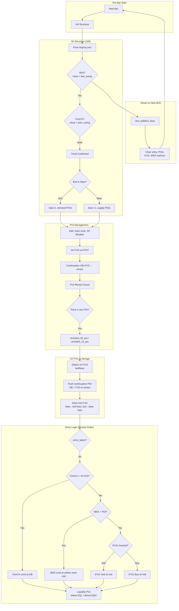
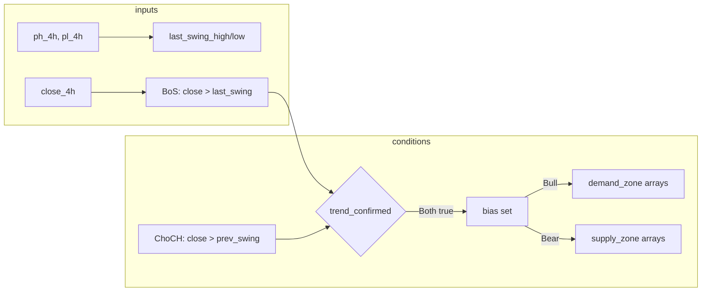
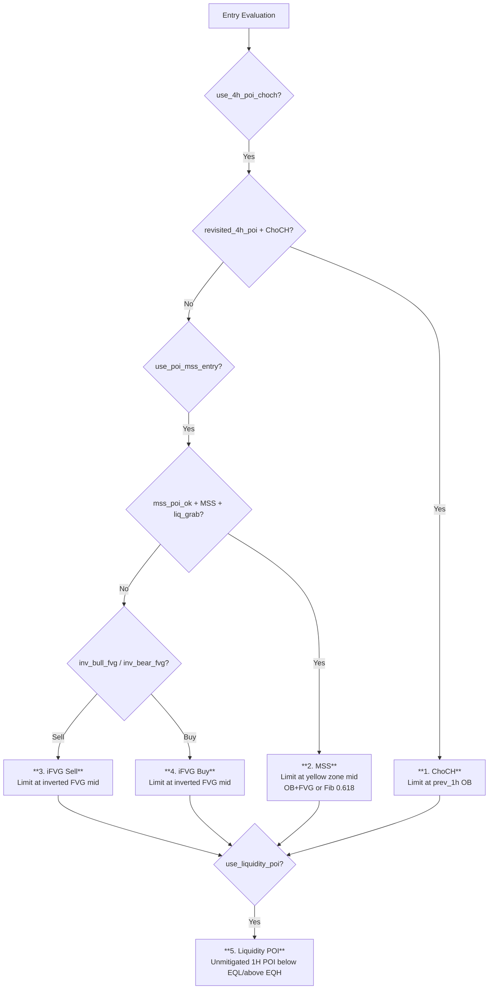
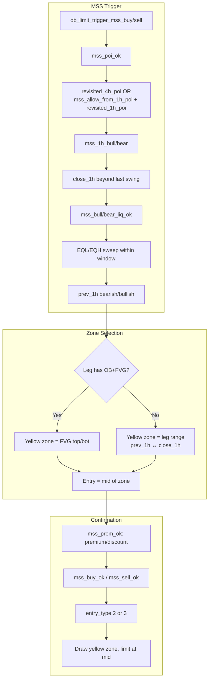
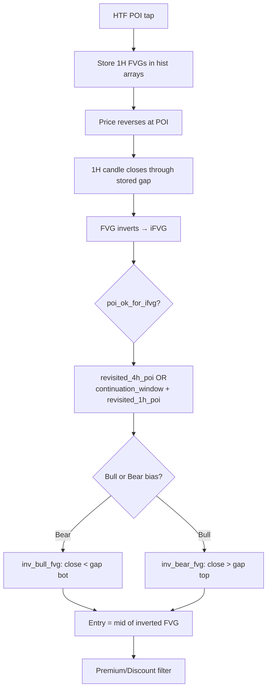
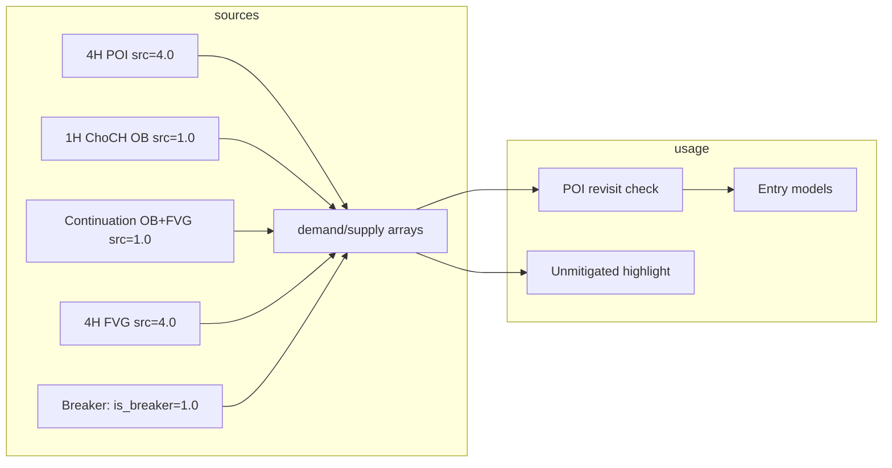

# Athena Inv V2.5 — Logic Flowchart

## High-Level Flow

---

## 4H Trend Confirmation (Detail)

---

## Entry Model Priority

---

## MSS Entry Flow (Detail)

---

## iFVG Entry Flow

---

## POI Arrays & Sources

---

## Key Variables Summary

| Variable | Purpose |
|----------|---------|
| `bias` | 1=bull, -1=bear (from 4H ChoCH+BoS) |
| `entry_type` | 0=none, 1=iFVG, 2=MSS(OB+FVG), 3=MSS(Fib) |
| `ifvg_zone_hi/lo` | Yellow zone bounds (MSS) or iFVG bounds |
| `ob_limit_level` | ChoCH: prev_1h OB. MSS: mid of yellow zone |
| `revisited_4h_poi` | Price traded into 4H-tagged POI |
| `revisited_1h_poi` | Price traded into 1H-tagged POI |
